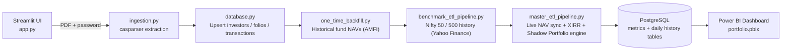
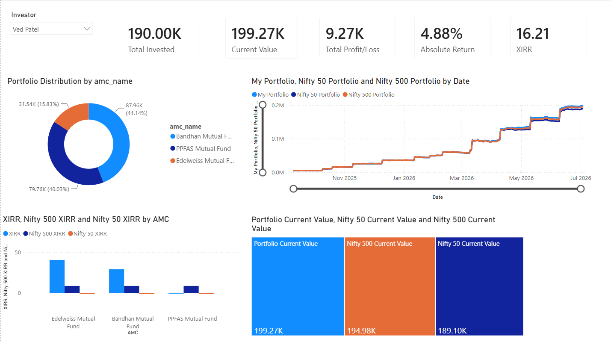

# CAS-Driven Portfolio Benchmarking Dashboard

**A privacy-first mutual fund analytics engine that answers one question your investing app won't: "Am I actually beating the market, given exactly when I invested?"**


---

## Why this exists

Every CAMS/KFintech Consolidated Account Statement (CAS) contains a complete, accurate record of every mutual fund transaction across every AMC an investor holds — but it's locked in a password-protected PDF, and no free tool lets you benchmark it properly without uploading your financial data to a third party.

At the same time, platforms like MF Central show you your own returns, but never answer the real question a SIP investor actually cares about: **"If I'd put this exact money, on these exact dates, into a Nifty index fund instead — would I be ahead or behind?"** Naive comparisons (my CAGR vs. index CAGR) don't answer this correctly for SIP investing, because cash flow timing matters.

This project was built to answer that question — for one investor's real portfolio — without that data ever leaving a machine I control.

## What it actually does

- **Zero-retention CAS parsing.** Upload a password-protected CAS PDF through a local Streamlit UI. `casparser` extracts every transaction in-memory; the temporary file written to disk during parsing is deleted in a `finally` block immediately after — success or failure — so nothing sensitive persists on disk after a run (see `ingestion.py`).
- **Cash-flow-matched shadow-portfolio benchmarking.** Every transaction is replicated into a parallel synthetic Nifty 50 and Nifty 500 purchase on the same date, using `merge_asof` to align each contribution with the nearest prior closing price, then compounded forward day-by-day (`master_etl_pipeline.py::calculate_benchmark_shadow_daily`). The resulting shadow portfolio's own XIRR is what gets compared against the real portfolio's XIRR — a like-for-like comparison, not a blended index return.
- **Daily portfolio reconstruction, not "since dashboard creation."** Actual portfolio value is rebuilt for every calendar day since the first transaction, by cross-joining each investor's fund holdings against a full historical NAV table and forward-filling non-trading days (`calculate_actual_portfolio_daily`).
- **Incremental, idempotent data pipelines.** Both the benchmark index fetcher (`benchmark_etl_pipeline.py`) and the historical NAV backfill (`one_time_backfill.py`) check the latest date already stored before calling their APIs, so re-running the pipeline only pulls what's missing — no duplicate downloads, no duplicate rows (enforced further by `UNIQUE` constraints and `ON CONFLICT DO NOTHING` upserts in `database.py`).
- **Live valuation on every run.** Current fund NAVs are pulled fresh from AMFI via `mftool` each time the pipeline runs, so "current value" and live XIRR are never stale.
- **Relational schema designed for multiple investors.** `investors → folios → transactions` is enforced via foreign keys with cascading deletes, so the system is structurally built to hold more than one investor's data — see [Known Limitations](#known-limitations-and-roadmap) for what's tested vs. designed.
- **Interactive Power BI layer.** AMC-level cross-filtering dynamically recalculates every KPI card and XIRR comparison — selecting a single fund house instantly re-scopes invested amount, current value, and outperformance vs. benchmark.

## Architecture



The pipeline stages run in a strict dependency order (enforced by `app.py`'s orchestration): historical NAVs must exist before benchmark history is locked in, and both must exist before the master analytics engine can compute daily portfolio values and shadow-benchmark XIRR.

**Why raw data and computed metrics are handled differently:** source-of-truth tables (`historical_navs`, `benchmark_historical`, `transactions`) are append-only and grow incrementally — never deleted. Derived tables (`folio_metrics`, `portfolio_metrics`, `benchmark_metrics`, `shadow_benchmark_values`, `portfolio_history_daily`) are fully truncated and recomputed on every run, since they're deterministic functions of the raw data — there's no correctness reason to patch them incrementally, and a full rebuild guarantees they can never drift out of sync with the source tables.

## Tech Stack

| Layer | Tools |
|---|---|
| Ingestion | Python, [`casparser`](https://pypi.org/project/casparser/), Streamlit |
| Data Storage | PostgreSQL, SQLAlchemy, psycopg2 |
| Market Data | `yfinance` (Nifty 50/500 history), `mftool` (AMFI live + historical NAVs) |
| Analytics Engine | Python, `pandas`, [`pyxirr`](https://pypi.org/project/pyxirr/) |
| Visualization | Power BI, DAX |
| Config | `python-dotenv` (no credentials committed to source) |

## Database Schema

11 tables, split by purpose:

**Raw / source-of-truth (append-only):**
| Table | Purpose |
|---|---|
| `investors` | One row per investor; unique on email |
| `folios` | Investor's fund folios; unique on (folio_number, investor_id) |
| `transactions` | Every parsed CAS transaction; deduplicated via composite unique constraint |
| `historical_navs` | Daily historical NAV per fund (AMFI), capped from 2020-01-01 |
| `benchmark_historical` | Daily Nifty 50 / Nifty 500 closing prices, from 2000-01-01 |
| `live_navs` | Latest live NAV snapshot per fund (replaced each run) |

**Derived / computed (rebuilt each run):**
| Table | Purpose |
|---|---|
| `folio_metrics` | Per-folio invested amount, current value, XIRR |
| `portfolio_metrics` | Per-investor rolled-up invested amount, current value, XIRR |
| `benchmark_metrics` | Shadow-portfolio XIRR per benchmark |
| `portfolio_history_daily` | Reconstructed daily portfolio value, per investor |
| `shadow_benchmark_values` | Reconstructed daily shadow-portfolio value, per benchmark |

Full DDL: [`database_schema.sql`](./database_schema.sql).

## Screenshots & Demo

> This project is intentionally **not publicly hosted** — see [Privacy & Security](#privacy--security) for why. The screenshots and recording below are provided so the project can be evaluated without exposing real personal financial data.

**Dashboard overview** *(live snapshot — numbers reflect an active, ongoing portfolio, not a completed track record)*

```

```
*(Add your screenshot to an `assets/` folder in the repo and update the path above — GitHub will render it automatically.)*

**Walkthrough recording**

To add a demo video: drag an `.mp4` or `.mov` file directly into a GitHub Issue or Pull Request comment box (even a draft one) — GitHub will host it and give you a URL. Then embed it here:

```html
<video src="PASTE_GITHUB_HOSTED_VIDEO_URL_HERE" controls width="700"></video>
```

Alternatively, link an unlisted screen recording (Loom, YouTube unlisted, etc.):

```
[Watch the full walkthrough](PASTE_LINK_HERE)
```

## Privacy & Security

This project exists specifically because CAS statements contain sensitive personal financial data, and I didn't want to trust that data to a third-party platform:

- CAS PDFs are parsed **transiently** — the temp file created during parsing is explicitly deleted in a `finally` block immediately after extraction, whether parsing succeeds or fails.
- The CAS password is only ever held in memory for the duration of a single parse call; it is never logged or persisted.
- Database credentials are loaded from environment variables via `python-dotenv` and are never committed to source control.
- All parsed data stays in a private, locally-controlled PostgreSQL instance — nothing is sent to any external analytics or storage service.
- The Power BI dashboard is **not deployed publicly**, by design, since the underlying data is real personal investment information.

## Known Limitations and Roadmap

Being upfront about what this is and isn't today:

- **Shadow-benchmark calculation is not yet investor-segmented.** `calculate_benchmark_shadow_daily` currently aggregates transaction cash flows across all investors before simulating the benchmark purchase. With a single investor's data (current state), this is correct; extending it to `groupby(investor_id)` is required before it's accurate for multiple investors. Tracked as the top priority next step.
- **Multi-investor support is architecturally complete but not load-tested.** The schema (`investors → folios → transactions`) and the actual daily-portfolio-value calculation are both correctly segmented by `investor_id`. It has not yet been run against more than one investor's real data.
- **Historical fund NAV backfill is capped at 2020-01-01** for practicality; benchmark index history goes back to 2000-01-01.
- **Risk-adjusted metrics are not yet implemented.** Currently reports XIRR and absolute outperformance only. Sharpe ratio, Sortino ratio, and Beta are planned additions.
- **Orchestration is sequential subprocess calls, not a scheduler.** Works correctly for a single-user, on-demand workflow; would need Airflow/cron (or similar) for unattended scheduled runs.

## Setup & Local Run

```bash
# 1. Clone the repository
git clone <your-repo-url>
cd <repo-folder>

# 2. Install dependencies
pip install streamlit casparser psycopg2-binary python-dotenv pandas SQLAlchemy yfinance mftool pyxirr

# 3. Create a .env file (never commit this)
DB_USER=your_user
DB_PASSWORD=your_password
DB_HOST=localhost
DB_PORT=5432
DB_NAME=your_db_name

# 4. Apply the schema
psql -U your_user -d your_db_name -f database_schema.sql

# 5. Launch the ingestion app
streamlit run app.py

# 6. Upload a CAS PDF + password in the browser
#    This triggers the full pipeline: backfill -> benchmark sync -> master analytics

# 7. Open portfolio.pbix in Power BI Desktop and point it at your PostgreSQL instance
```

## Project Structure

```
.
├── app.py                       # Streamlit UI + pipeline orchestration
├── ingestion.py                 # CAS PDF parsing (casparser), transient temp-file handling
├── database.py                  # Upsert logic: investors, folios, transactions
├── one_time_backfill.py         # Historical fund NAV backfill from AMFI
├── benchmark_etl_pipeline.py    # Incremental Nifty 50 / 500 historical price sync
├── master_etl_pipeline.py       # Live NAV sync, XIRR engine, shadow-portfolio benchmarking
├── database_schema.sql          # Full PostgreSQL DDL
└── portfolio.pbix               # Power BI dashboard
```

## Author

**Ved Patel**
[LinkedIn](https://linkedin.com/in/vedpatel18) · [GitHub](https://github.com/vedpatel18) 